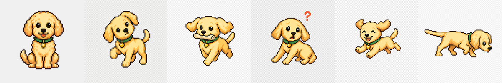
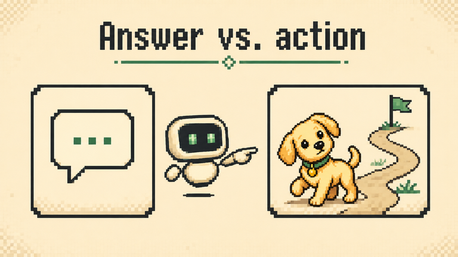
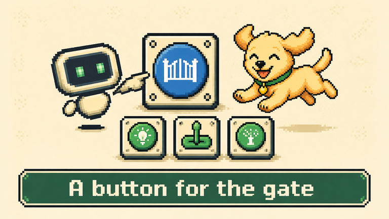
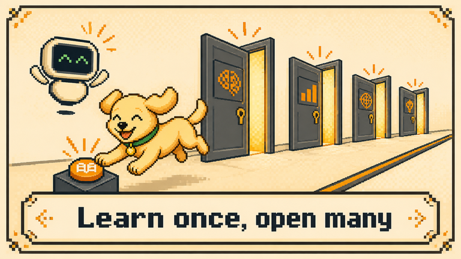
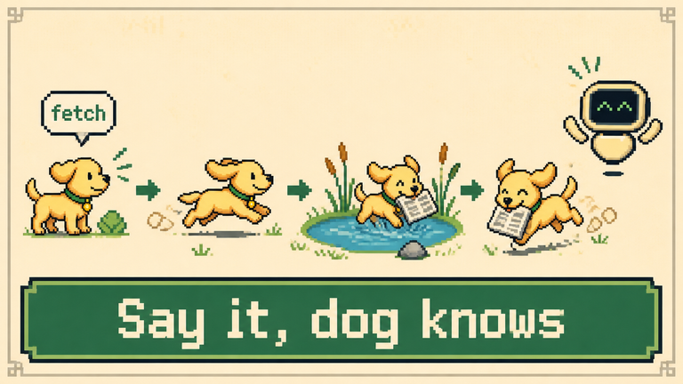
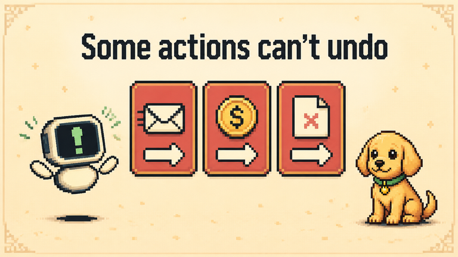
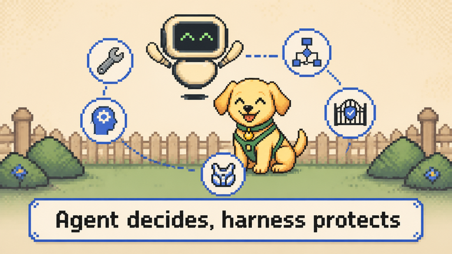
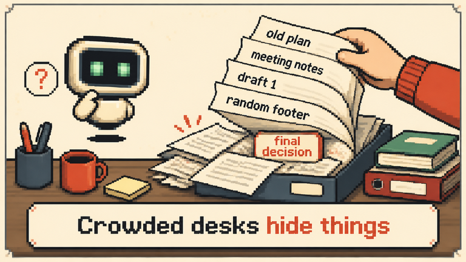
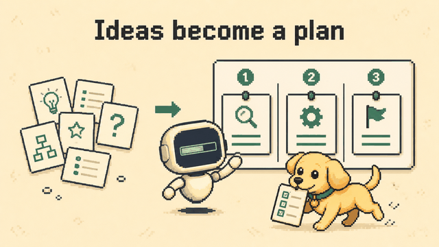

# AI Jargon Atlas — Video Pipeline

**English** · [한국어](#한국어-안내) — *both versions are side by side below / 아래에 영어와 한국어를 나란히 두었습니다.*

<table>
<tr>
<td width="50%" valign="top">

## What is this?

A pipeline that produces short (30–90 s) **bilingual EN + KR educational videos** explaining AI jargon to non-developers. Each episode is a cozy 16-bit pixel-art slideshow starring recurring, on-model characters: **Atlas** (a floating monitor-head robot) and **Byte** (a golden puppy).

An episode is just a small YAML file. Three stages turn it into an MP4:

1. **Script** — bilingual `script.json` (narration, on-screen text, cast & poses, visual intent)
2. **Images** — pixel-art frames, conditioned on each character's locked reference sheet
3. **Video** — local/OpenAI TTS voice-over + captions + crossfades → MP4

</td>
<td width="50%" valign="top">

## 이게 뭔가요?

비개발자에게 AI 용어를 설명하는 **30~90초 분량의 영어+한국어 이중 언어 교육 영상**을 만드는 파이프라인입니다. 각 에피소드는 16비트 픽셀아트 슬라이드 영상이며, 일관된 모습을 유지하는 캐릭터 **Atlas**(떠다니는 모니터 머리 로봇)와 **Byte**(골든 리트리버 강아지)가 등장합니다.

에피소드는 작은 YAML 파일 하나로 정의되고, 3단계를 거쳐 MP4가 됩니다.

1. **Script** — 이중 언어 `script.json` (나레이션, 화면 문구, 등장 캐릭터·포즈, 장면 묘사)
2. **Images** — 캐릭터별 잠금(locked) 레퍼런스를 기준으로 한 픽셀아트 프레임
3. **Video** — 로컬/OpenAI TTS 음성 + 자막 + 크로스페이드 → MP4

</td>
</tr>
</table>

```
episodes_yaml/episode_NN.yaml ──► Stage 1 ──► script.json ──► Stage 2 ──► images/S01_a.png, S01_b.png …
                                   (chat with Claude Code,                  (consistent characters)
                                    or the OpenAI API)                                │
                                                                                      ▼
                                                              Stage 3 ──► audio/*.wav ──► episode_en_overlay-ko.mp4
```

---

<table>
<tr>
<td width="50%" valign="top">

## Meet the cast

Characters are a **registry**. Each one has a *Bible*: a locked set of six reference poses (neutral, thinking, working, error, happy, pointing). Every scene is generated from the Bible images of whoever is in it, which is what keeps them on-model across dozens of episodes.

</td>
<td width="50%" valign="top">

## 등장 캐릭터

캐릭터는 **레지스트리**로 관리됩니다. 각 캐릭터는 6가지 포즈(neutral, thinking, working, error, happy, pointing)의 잠금된 레퍼런스 세트, 즉 *Bible*을 가집니다. 모든 장면은 등장하는 캐릭터의 Bible 이미지를 기준으로 생성되므로, 수십 개의 에피소드에서도 같은 모습이 유지됩니다.

</td>
</tr>
</table>

**Atlas** (`atlas/bible/`)


**Byte** (`characters/byte/`)



---

<table>
<tr>
<td width="50%" valign="top">

## Showcase: same characters, every scene

These frames come from different episodes of the *How AI Takes Action* series (Agent → Tool Calling → MCP → Agent Skill → Human-in-the-Loop → Agent Harness) plus an earlier *What AI Remembers* episode. Atlas and Byte keep the same face, palette and proportions while the scene around them changes completely — a metaphor each time (Byte as the "agent" sheepdog, Atlas as the explainer). Scenes that are pure diagrams simply list no characters.

The on-screen headline is rendered **into** the image; the narration and captions come from `script.json`.

</td>
<td width="50%" valign="top">

## 쇼케이스: 장면이 바뀌어도 캐릭터는 그대로

*How AI Takes Action* 시리즈(Agent → Tool Calling → MCP → Agent Skill → Human-in-the-Loop → Agent Harness)와 앞선 *What AI Remembers* 에피소드에서 가져온 프레임입니다. 장면의 배경과 소재는 매번 완전히 달라지지만 Atlas와 Byte의 얼굴, 색감, 비율은 그대로입니다. 에피소드마다 비유(Byte는 "에이전트" 양치기 개, Atlas는 설명하는 안내자)를 하나씩 둡니다. 다이어그램만 있는 장면은 캐릭터를 비워 둡니다.

화면 속 짧은 제목은 이미지 **안에** 직접 그려지고, 나레이션과 자막은 `script.json`에서 옵니다.

</td>
</tr>
</table>

| Agent · *Answer vs. action* | Agent · *Ideas become a plan* |
|:--:|:--:|
|  |  |
| **Tool Calling** · *A button for the gate* | **MCP** · *Learn once, open many* |
|  |  |
| **Agent Skill** · *Say it, dog knows* | **Human-in-the-Loop** · *Some actions can't undo* |
|  |  |
| **Agent Harness** · *Agent decides, harness protects* | **Context Window** · *Crowded desks hide things* |
|  |  |

<table>
<tr>
<td width="50%" valign="top">

**2-frame idle loop.** Each scene gets two frames, A and B. Frame B is edited from A with everything pixel-locked except *one* tiny motion (e.g. Atlas's float-bob), so the video alternates between them at ~2 fps for a subtle "alive" feel.

</td>
<td width="50%" valign="top">

**2프레임 idle 루프.** 장면마다 A, B 두 프레임을 만듭니다. B는 A를 기반으로 *한 가지* 아주 작은 움직임(예: Atlas가 위아래로 떠다님)만 바꾸고 나머지는 픽셀 단위로 고정해서, 영상에서 약 2fps로 번갈아 보여주면 은은하게 살아 움직이는 느낌이 납니다.

</td>
</tr>
</table>

<p align="center"></p>

---

<table>
<tr>
<td width="50%" valign="top">

## Workflow: from idea to illustrated scenes

How a consistent-character episode is made:

1. **Characters are locked once.** Seed image → 5 pose variants → review `quality_check.png` → `lock`. Never regenerated by accident.
2. **The script decides who appears.** Each scene's `characters` is e.g. `[{"name":"atlas","pose":"pointing"},{"name":"byte","pose":"thinking"}]`, or `[]` for a pure diagram.
3. **Stage 2 builds the image prompt per scene**: `visual_intent` + the headline + a *reference map* that tells the image model which attached Bible image is which character and which pose, plus an anatomy block so the two characters don't bleed into each other.
4. **Frame A** is generated with those Bible images as references (OpenAI `images.edit`, or your own local server). **Frame B** is derived from A as the idle-loop second cel.
5. **Re-roll one scene** without touching the rest: `atlas episode regen 16 S09`.

Because every image is conditioned on the *locked* references rather than on previous outputs, characters don't drift from episode to episode.

</td>
<td width="50%" valign="top">

## 워크플로: 아이디어에서 장면 일러스트까지

캐릭터가 일관된 에피소드를 만드는 과정입니다.

1. **캐릭터는 한 번만 잠급니다.** 시드 이미지 → 5개 포즈 생성 → `quality_check.png` 확인 → `lock`. 실수로 다시 생성되지 않습니다.
2. **대본이 누가 등장할지 정합니다.** 장면의 `characters`에 `[{"name":"atlas","pose":"pointing"},{"name":"byte","pose":"thinking"}]`처럼 쓰거나, 다이어그램 장면이면 `[]`로 둡니다.
3. **Stage 2가 장면별 이미지 프롬프트를 만듭니다.** `visual_intent` + 제목 문구 + *레퍼런스 맵*(첨부된 Bible 이미지가 어느 캐릭터의 어떤 포즈인지 알려줌) + 두 캐릭터가 서로 섞이지 않게 하는 해부학 블록을 합칩니다.
4. **프레임 A**는 해당 Bible 이미지들을 레퍼런스로 생성합니다(OpenAI `images.edit` 또는 로컬 서버). **프레임 B**는 A에서 파생한 idle 루프의 두 번째 컷입니다.
5. **한 장면만 다시 뽑기**: `atlas episode regen 16 S09`.

모든 이미지가 이전 결과물이 아니라 *잠금된* 레퍼런스를 기준으로 생성되기 때문에, 에피소드가 쌓여도 캐릭터가 변하지 않습니다.

</td>
</tr>
</table>

---

<table>
<tr>
<td width="50%" valign="top">

## Script *and* illustration in one chat (Claude Code)

You don't have to hand-write JSON or pay for a stage-1 API call. The repo ships an **`/episode-script` skill** (`.claude/skills/episode-script/SKILL.md`, mirrored in `.agents/skills/` for Codex and other agents). Open the project in Claude Code and talk:

- the agent reads the episode YAML, proposes beats, narration, headlines, **which characters appear and in what pose**, and the visual intent per scene;
- you iterate scene by scene ("make S04 punchier", "put Byte in S06 too");
- it writes `script.json` (UTF-8, EN+KR), validates the schema and the character names/poses;
- then it hands you the next command — or, if you ask, runs stage 2 and 3 for you.

So a single Claude Code session can take an episode from a YAML brief all the way to an illustrated, voiced video.

</td>
<td width="50%" valign="top">

## 대본부터 일러스트까지, 채팅 한 번으로 (Claude Code)

JSON을 직접 쓰거나 Stage 1 API 비용을 쓸 필요가 없습니다. 이 저장소에는 **`/episode-script` 스킬**(`.claude/skills/episode-script/SKILL.md`, Codex 등 다른 에이전트용 사본은 `.agents/skills/`)이 들어 있습니다. Claude Code에서 프로젝트를 열고 대화하면 됩니다.

- 에이전트가 에피소드 YAML을 읽고 비트 구성, 나레이션, 화면 문구, **어떤 캐릭터가 어떤 포즈로 나올지**, 장면별 visual intent를 제안합니다.
- 장면 단위로 다듬습니다("S04를 더 임팩트 있게", "S06에도 Byte를 넣어줘").
- `script.json`(UTF-8, 영/한)을 쓰고, 스키마와 캐릭터 이름/포즈를 검증합니다.
- 그다음 실행할 명령을 알려주거나, 요청하면 Stage 2·3까지 직접 실행합니다.

즉 하나의 Claude Code 세션에서 YAML 브리프로 시작해 일러스트와 음성이 입혀진 영상까지 만들 수 있습니다.

</td>
</tr>
</table>

Example session / 예시 대화:

```text
you      /episode-script 16
claude   Episode 16 "Agent": I'll use the sheepdog metaphor — Byte is the agent, Atlas explains.
         Draft: 12 scenes, 90 s.  S01 HOOK  "Answer vs. action"  atlas:pointing + byte:thinking
                                  S04 DEFINITION (diagram only, characters: [])
                                  S09 CONCRETE_EXAMPLE "Ideas become a plan"  atlas:working + byte:working
         Want S09 to show Byte carrying the checklist?
you      응, 그리고 S10에서 Byte가 길을 잘못 드는 장면을 넣어줘.
claude   Updated S10 (byte:error, "Adjust, then continue") and wrote episodes/c04_e16_agent/script.json.
         Validation OK. Next: uv run atlas episode run 16 --stages 2
you      Go ahead and run stage 2 and 3.
```

---

## Quick start / 빠른 시작

<table>
<tr>
<td width="50%" valign="top">

**1. Setup**

```bash
uv sync
```

Create `.env`:

```
SCRIPT_API='sk-...'   # stage 1 (OpenAI, optional if you chat-write scripts)
IMAGE_API='sk-...'    # stage 2 (gpt-image-2)
TTS_API='sk-...'      # only for --tts openai
```

Stage 3 voice-over defaults to **Supertonic** (local, free). Model files download once into `models/supertonic/`.

</td>
<td width="50%" valign="top">

**1. 설치**

```bash
uv sync
```

`.env` 파일을 만듭니다.

```
SCRIPT_API='sk-...'   # Stage 1 (OpenAI, 대본을 채팅으로 쓰면 생략 가능)
IMAGE_API='sk-...'    # Stage 2 (gpt-image-2)
TTS_API='sk-...'      # --tts openai 사용 시에만
```

Stage 3 음성은 기본적으로 **Supertonic**(로컬, 무료)을 씁니다. 모델 파일은 처음 한 번 `models/supertonic/`에 다운로드됩니다.

</td>
</tr>
</table>

**2. Character Bibles (one-time) / 캐릭터 Bible 생성 (1회)**

```bash
uv run atlas character generate atlas   # from seeds/atlas_neutral.png
# review atlas/bible/quality_check.png, then:
uv run atlas character lock atlas
uv run atlas character list             # shows every character + status
```

**3. Make an episode / 에피소드 만들기** (e.g. `16`)

```bash
# Stage 1 — script: chat with Claude Code (/episode-script 16) or call the API
uv run atlas episode run 16 --stages 1 --dry-run   # preview prompt, no API call
uv run atlas episode run 16 --stages 1

# Stage 2 — images (2 frames per scene)
uv run atlas episode run 16 --stages 2 --dry-run
uv run atlas episode run 16 --stages 2 --quality low   # cheap drafts
uv run atlas episode regen 16 S03                      # re-roll one scene

# Stage 3 — voice + video
uv run atlas episode run 16 --stages 3 --lang en --overlay ko
```

<table>
<tr>
<td width="50%" valign="top">

**Stage 3 options**

| Flag | Meaning |
|---|---|
| `--lang en\|ko` | voice-over language |
| `--overlay en\|ko\|none` | caption language |
| `--tts supertonic\|openai` | TTS engine (default local) |
| `--speed 0.25–4.0` | speech speed (default 1.1) |
| `--scene S03` | only that scene |
| `--no-tts` | rebuild video from existing audio |
| `--force` | regenerate existing outputs |

Audio length is authoritative; scenes crossfade (~0.4 s) with a uniform ~0.9 s pause after each line. Tunables live at the top of `assemble_video()` in `stage3_video.py`.

</td>
<td width="50%" valign="top">

**Stage 3 옵션**

| 플래그 | 의미 |
|---|---|
| `--lang en\|ko` | 음성 언어 |
| `--overlay en\|ko\|none` | 자막 언어 |
| `--tts supertonic\|openai` | TTS 엔진 (기본: 로컬) |
| `--speed 0.25–4.0` | 말하기 속도 (기본 1.1) |
| `--scene S03` | 해당 장면만 |
| `--no-tts` | 기존 오디오로 영상만 재조립 |
| `--force` | 기존 결과 덮어쓰기 |

오디오 길이가 기준입니다. 장면은 약 0.4초 크로스페이드로 이어지고, 각 대사 뒤에 약 0.9초의 일정한 간격이 들어갑니다. 조절 값은 `stage3_video.py`의 `assemble_video()` 상단에 있습니다.

</td>
</tr>
</table>

Status & cost / 상태와 비용: `uv run atlas episode status 16`, `uv run atlas costs`. Every stage is idempotent — it skips existing files unless `--force`. / 모든 단계는 멱등적이며 `--force` 없이는 기존 파일을 건너뜁니다.

---

<table>
<tr>
<td width="50%" valign="top">

## Adding a new episode

Create `episodes_yaml/episode_NN.yaml` (0-indexed filename; `episode_number` inside is authoritative):

```yaml
episode_number: 12
cluster: 3
cluster_name: "What AI Remembers & Knows"
terms:
  - "Token"
tier: "T2"   # T1 everyday · T2 workplace · T2.5 capability · T2.7 technical knob · T3 big-picture
one_line_gist: "The atomic unit of text that LLMs read and count."
metaphor_seed: "words chopped into syllables"
example_scenario: "ChatGPT hitting its context limit mid-conversation"
target_length_sec: 60
next_episode_teaser: "Knowledge Cutoff"
```

The 50-term plan is kept in the local, git-ignored `plan_files/` folder; list what exists with `uv run atlas curriculum` / `uv run atlas episode list`.

</td>
<td width="50%" valign="top">

## 새 에피소드 추가

`episodes_yaml/episode_NN.yaml`을 만듭니다(파일명은 0부터 시작, 내부 `episode_number`가 기준).

```yaml
episode_number: 12
cluster: 3
cluster_name: "What AI Remembers & Knows"
terms:
  - "Token"
tier: "T2"   # T1 일상 · T2 업무 · T2.5 기능 · T2.7 기술 설정 · T3 큰 그림
one_line_gist: "LLM이 실제로 읽고 세는 텍스트의 최소 단위."
metaphor_seed: "단어를 음절로 쪼갠 조각"
example_scenario: "대화 도중 ChatGPT가 컨텍스트 한도에 도달"
target_length_sec: 60
next_episode_teaser: "Knowledge Cutoff"
```

50개 용어 계획은 git에 올리지 않는 로컬 `plan_files/` 폴더에 두며, 현재 에피소드 목록은 `uv run atlas curriculum` / `uv run atlas episode list`로 확인합니다.

</td>
</tr>
</table>

<table>
<tr>
<td width="50%" valign="top">

## Adding a new character

1. Save a clean ~1024×1024 transparent pixel-art **neutral** seed as `seeds/<id>_neutral.png`.
2. Register it in `src/atlas_pipeline/characters.py` (id, display name, `shared_block` description, short `blurb` and `tagline`, and 5 pose deltas via `make_expression_prompts()`). See `character_byte.py` for a worked example.
3. `uv run atlas character generate <id>` → review `characters/<id>/quality_check.png` → `uv run atlas character lock <id>`.
4. Stage 1 and the `/episode-script` skill automatically see every registered character; place them in a scene with `"characters": [{"name":"atlas","pose":"pointing"},{"name":"byte","pose":"happy"}]`.

Two characters in one image is the hardest case — keep each one's role in `visual_intent` explicit and distinct.

</td>
<td width="50%" valign="top">

## 새 캐릭터 추가

1. 투명 배경의 깔끔한 ~1024×1024 **neutral** 시드 픽셀아트를 `seeds/<id>_neutral.png`로 저장합니다.
2. `src/atlas_pipeline/characters.py`에 등록합니다(id, 표시 이름, `shared_block` 설명, 짧은 `blurb`·`tagline`, `make_expression_prompts()`용 포즈 5개). 예시는 `character_byte.py`를 참고하세요.
3. `uv run atlas character generate <id>` → `characters/<id>/quality_check.png` 확인 → `uv run atlas character lock <id>`.
4. Stage 1과 `/episode-script` 스킬은 등록된 모든 캐릭터를 자동 인식합니다. `"characters": [{"name":"atlas","pose":"pointing"},{"name":"byte","pose":"happy"}]`처럼 장면에 배치하세요.

한 이미지에 두 캐릭터를 넣는 것이 가장 어렵습니다. `visual_intent`에서 각자의 역할을 분명하고 다르게 적어 주세요.

</td>
</tr>
</table>

<table>
<tr>
<td width="50%" valign="top">

## `script.json` at a glance

```
{ "meta": {...}, "scenes": [...], "quality_checks": {...} }
```

Each scene is one visual:

| Field | Role |
|---|---|
| `scene_id` | `S01`, `S02`… (file names) |
| `beat` | HOOK · DEFINITION · METAPHOR · CONCRETE_EXAMPLE · WHY_IT_MATTERS · STICKY_TAKEAWAY |
| `narration.en/ko` | voice-over **and** captions |
| `on_screen_text.en/ko` | ≤7-word headline baked into the image |
| `characters` | `[{name, pose}]`, 0–2 characters |
| `visual_intent` | plain-language scene description → image prompt |
| `duration_sec` | target only; real audio length wins |

You can hand-edit it any time; stages 2–3 read whatever is in the file.

</td>
<td width="50%" valign="top">

## `script.json` 한눈에 보기

```
{ "meta": {...}, "scenes": [...], "quality_checks": {...} }
```

각 장면은 하나의 화면입니다.

| 필드 | 역할 |
|---|---|
| `scene_id` | `S01`, `S02`… (파일 이름) |
| `beat` | HOOK · DEFINITION · METAPHOR · CONCRETE_EXAMPLE · WHY_IT_MATTERS · STICKY_TAKEAWAY |
| `narration.en/ko` | 음성 **및** 자막 |
| `on_screen_text.en/ko` | 이미지에 그려지는 7단어 이내 제목 |
| `characters` | `[{name, pose}]`, 0~2명 |
| `visual_intent` | 장면 설명 → 이미지 프롬프트 |
| `duration_sec` | 목표치일 뿐, 실제 오디오 길이가 우선 |

언제든 직접 수정할 수 있고, Stage 2·3은 파일에 있는 내용을 그대로 읽습니다.

</td>
</tr>
</table>

<table>
<tr>
<td width="50%" valign="top">

## Run your own image backend (optional)

Swap gpt-image-2 for a local FLUX.2 [klein] server at no API cost:

```
IMAGE_PROVIDER=local
IMAGE_LOCAL_URL=http://127.0.0.1:8000/generate
```
```bash
uv run atlas episode run 16 --stages 2 --image-provider local
```

The endpoint receives `{prompt, width, height, reference_images[], steps}` (Bible PNGs or frame A, base64) and returns a PNG. See [`docs/local_image_server.md`](docs/local_image_server.md) and [`docs/comfyui_local_image_server.md`](docs/comfyui_local_image_server.md).

</td>
<td width="50%" valign="top">

## 로컬 이미지 백엔드 사용 (선택)

API 비용 없이 gpt-image-2 대신 로컬 FLUX.2 [klein] 서버를 쓸 수 있습니다.

```
IMAGE_PROVIDER=local
IMAGE_LOCAL_URL=http://127.0.0.1:8000/generate
```
```bash
uv run atlas episode run 16 --stages 2 --image-provider local
```

엔드포인트는 `{prompt, width, height, reference_images[], steps}`(Bible PNG 또는 프레임 A, base64)를 받아 PNG를 돌려줍니다. 자세한 내용은 [`docs/local_image_server.md`](docs/local_image_server.md), [`docs/comfyui_local_image_server.md`](docs/comfyui_local_image_server.md)를 참고하세요.

</td>
</tr>
</table>

---

## Repository layout / 폴더 구조

```
episodes_yaml/        episode inputs / 에피소드 입력 (YAML)
episodes/             generated outputs / 생성 결과물 (git-ignored): script.json, images/, audio/, *.mp4
atlas/bible/          Atlas reference poses (locked) / Atlas 레퍼런스
characters/<id>/      other characters' Bibles (e.g. byte) / 다른 캐릭터 Bible
src/atlas_pipeline/   cli.py, stage1_script.py, stage2_images.py, stage3_video.py,
                      characters.py, atlas_bible.py, character_byte.py, image_local.py, tts_local.py …
tests/                pytest suite / 테스트
seeds/                neutral seed images for character Bibles / 캐릭터 Bible용 neutral 시드 이미지
plan_files/           local-only planning docs (git-ignored) / 로컬 전용 기획 문서 (git 제외)
docs/                 local image-server specs + README images / 로컬 이미지 서버 규격 + README 이미지
.claude/skills/       /episode-script skill / 대본 작성 스킬 (mirrored in .agents/skills/)
logs/api_calls.jsonl  local append-only cost log (git-ignored) / 로컬 비용 로그 (git 제외)
models/supertonic/    local TTS model (git-ignored) / 로컬 TTS 모델
```

Run tests / 테스트 실행: `uv run pytest`

---

## 한국어 안내

이 문서는 영어와 한국어를 섹션별로 **나란히** 배치했습니다. 좌측이 English, 우측이 한국어입니다. 모바일처럼 좁은 화면에서는 두 열이 위아래로 쌓여 보일 수 있습니다.
